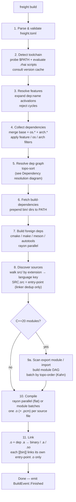
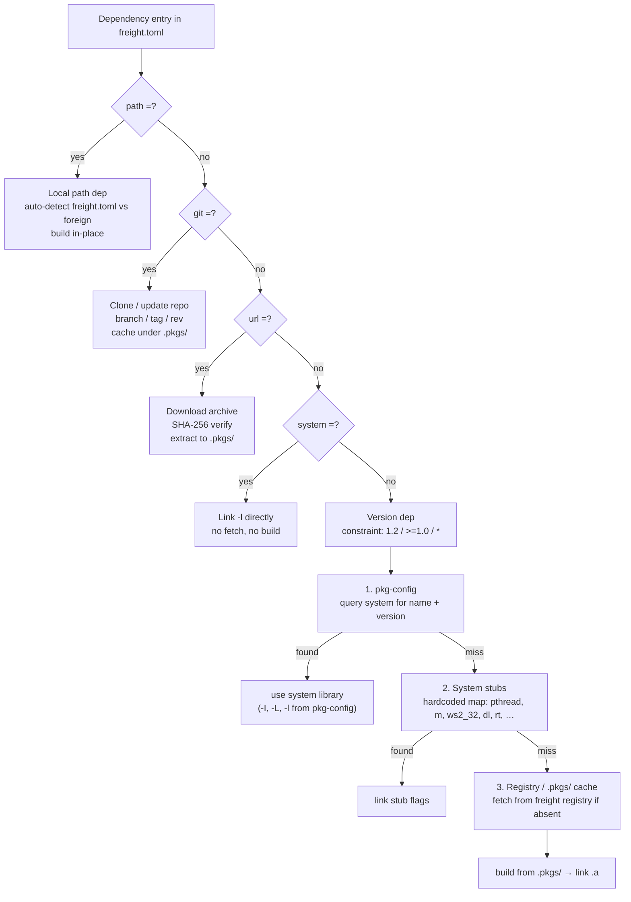
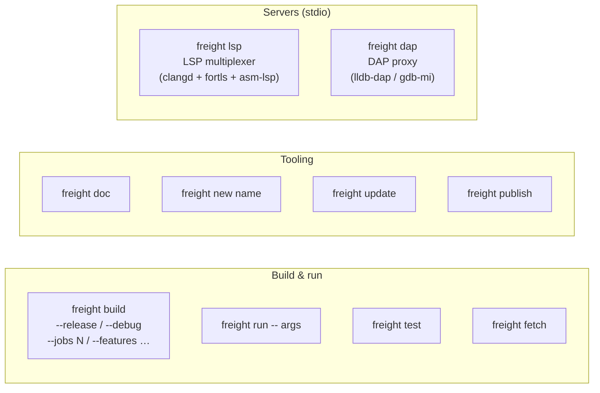
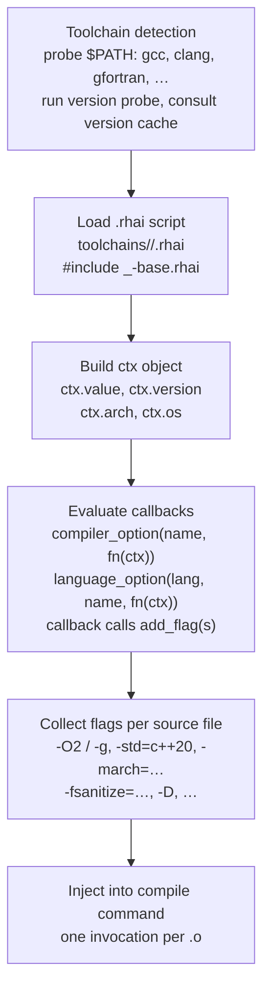
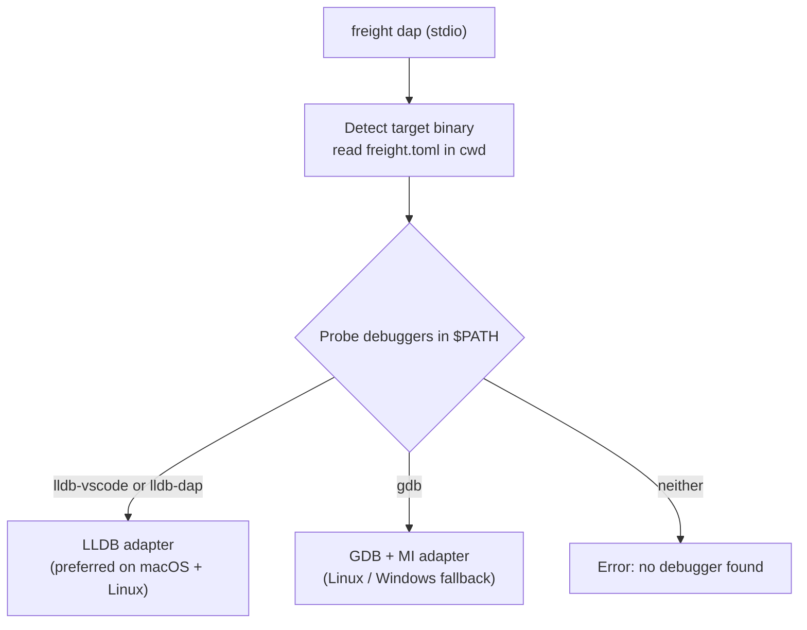
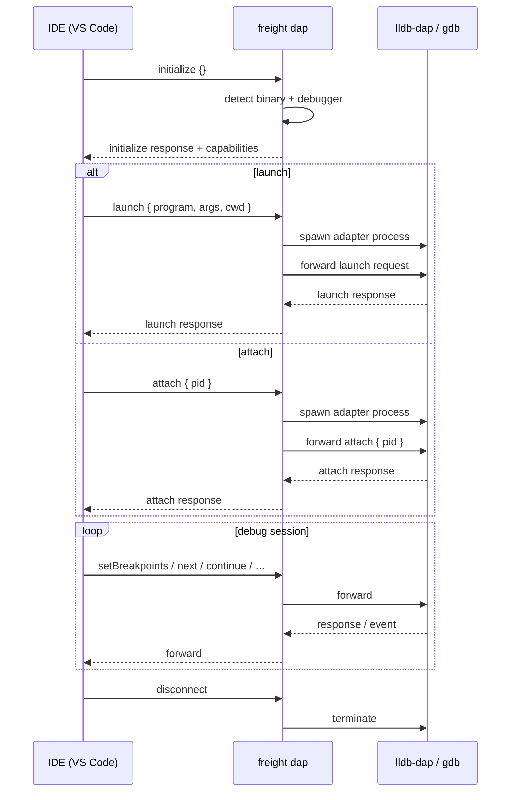
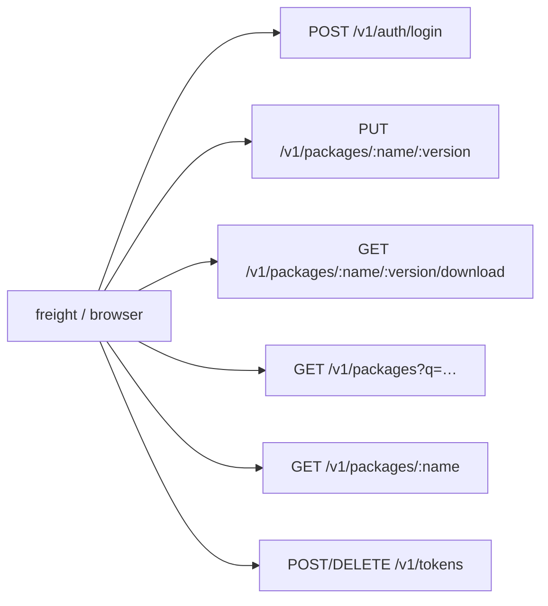
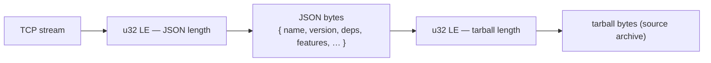
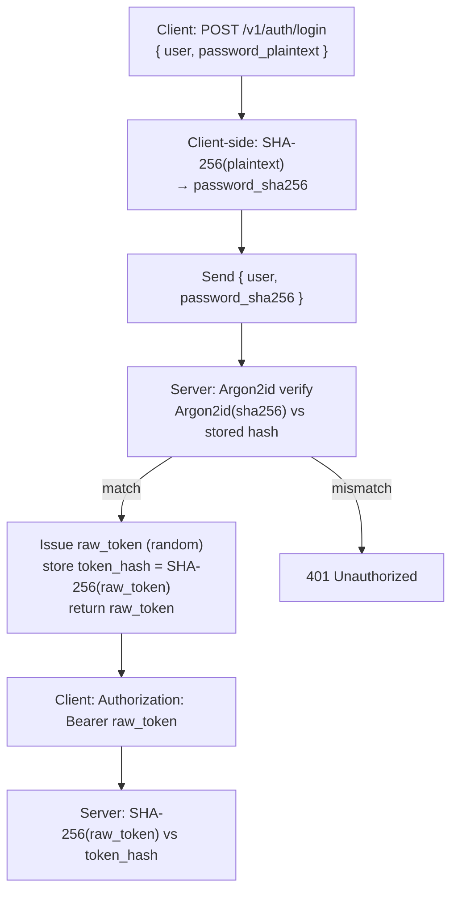

# Freight — Architecture

Internal documentation for contributors. Covers the repository layout, build engine
pipeline, architecture rules, and the key Rust dependencies.

---

## Repository layout

```
freight/
├── Cargo.toml                  # workspace root
├── README.md
├── crates/
│   └── freight/                # package `freight`, library crate `freight_core`, CLI binary `freight`
│       └── src/
│           ├── lib.rs          # build engine public API; emits BuildEvent, no CLI printing
│           ├── bin/freight/    # clap dispatch, commands, LSP, DAP, TUI, output formatting
│           ├── build/          # compile/link/dependency/workspace orchestration
│           ├── manifest/       # freight.toml parsing, workspace parsing, validation
│           ├── toolchain/      # compiler/debugger/tool template detection
│           ├── registry/       # package registry clients and repo dispatch
│           ├── fetch/          # git and URL/archive fetching into .pkgs/
│           ├── doc/            # dependency documentation browser/rendering
│           └── resolve/        # dependency resolution (pkg-config, system libs, build-dep bootstrap)
├── toolchains/                 # compiler, debugger, formatter, linter templates (.rhai) + system-lib stubs (.toml)
│   ├── system-libs/            # freight.toml-compatible stubs for well-known OS libraries
│   │   ├── pthread.toml        # Linux/macOS POSIX threads
│   │   ├── ws2_32.toml         # Windows Winsock2
│   │   └── …                   # 24 built-in stubs total (Linux, macOS, Windows)
│   ├── gnu/
│   │   ├── _gnu-base.rhai   # shared flags/toolset included by gnu compiler files
│   │   ├── g++.rhai
│   │   ├── gcc.rhai
│   │   ├── gfortran.rhai
│   │   ├── gdc.rhai         # D (GCC frontend)
│   │   └── gdb.rhai         # kind = "debugger"
│   ├── llvm/
│   │   ├── _llvm-base.rhai
│   │   ├── clang++.rhai
│   │   ├── clang.rhai
│   │   ├── flang.rhai
│   │   ├── ldc2.rhai        # D (LLVM frontend)
│   │   ├── lldb.rhai        # kind = "debugger"
│   │   ├── clang-format.rhai # kind = "formatter"
│   │   └── clang-tidy.rhai  # kind = "linter"
│   ├── nvidia/
│   │   ├── _nvhpc-base.rhai
│   │   ├── nvc++.rhai
│   │   ├── nvc.rhai
│   │   ├── nvfortran.rhai
│   │   └── nvcc.rhai        # requires_toolchain = ["cpp"]
│   ├── intel/
│   │   ├── _intel-base.rhai
│   │   ├── icpx.rhai
│   │   ├── ifx.rhai
│   │   └── ispc.rhai        # requires_toolchain = ["cpp"]
│   ├── amd/
│   │   └── hipcc.rhai       # requires_toolchain = ["cpp"]
│   ├── asm/
│   │   ├── _asm-base.rhai
│   │   ├── nasm.rhai
│   │   └── yasm.rhai
│   ├── languages/
│   │   ├── _cpp.rhai        # extensions, defaults, standards, linking for C++
│   │   ├── _c.rhai          # extensions, defaults, standards for C
│   │   └── _fortran.rhai    # extensions, defaults, standards, linking for Fortran
│   ├── astyle/
│   │   └── astyle.rhai      # kind = "formatter"
│   ├── uncrustify/
│   │   └── uncrustify.rhai  # kind = "formatter"
│   ├── fprettify/
│   │   └── fprettify.rhai   # kind = "formatter"  (Fortran)
│   ├── cppcheck/
│   │   └── cppcheck.rhai    # kind = "linter"
│   ├── cpplint/
│   │   └── cpplint.rhai     # kind = "linter"
│   ├── flawfinder/
│   │   └── flawfinder.rhai  # kind = "linter"
│   ├── dmd.rhai             # D reference compiler
│   ├── msvc.rhai
│   ├── tcc.rhai
│   └── opencl.rhai          # requires_toolchain = ["cpp"]
└── examples/                   # every example is buildable via `freight build`
    ├── c/hello/
    ├── cpp/hello/
    ├── cpp/modules/
    ├── cpp/multi-bin/
    ├── assembly/hello/
    ├── mixed/c-cpp/
    ├── mixed/tri-lang/
    ├── deps/cmake/
    ├── deps/make/
    ├── deps/git/
    ├── deps/external/
    └── misc/doc/
```

---

## Build engine pipeline

```
freight build
  │
  ├── 1. Parse + validate freight.toml
  ├── 2. Detect toolchain (probe $PATH, evaluate .rhai scripts, version cache)
  ├── 3. Resolve dependency graph (topo sort, compile path deps in order)
  │       ├── freight deps: compile dep → archive (.a)
  │       ├── foreign deps: cmake/meson/make/autotools/scons → install → collect headers + archive
  │       └── collect dep include dirs
  ├── 4. Walk src/ — discover sources by file extension → language key
  ├── 5. Scan C++ sources for `export module` / `import` declarations
  │       ├── [no modules] → flat parallel compile (step 6a)
  │       └── [modules found] → module-aware pipeline (step 6b)
  ├── 6a. Flat: dirty-check + compile all sources in parallel (rayon)
  ├── 6b. Module-aware:
  │       ├── topo-sort MIUs into batches (Kahn's algorithm)
  │       ├── for each batch: compile MIUs in parallel → produce .pcm + .o
  │       │     GCC: one pass with -fmodule-output=
  │       │     Clang: --precompile → .pcm, then -c → .o
  │       └── compile MImplUs + regular TUs in parallel with -fmodule-file= per import
  └── 7. Link all .o + dep .a files → binary / .a / .so
          (each [[bin]] only links its own entry-point .o, not other bins')
```

---

## Build pipeline (Mermaid)



---

## Dependency resolution



---

## CLI commands



---

## Compiler template evaluation



---

## DAP architecture

### Adapter selection



### Launch / attach sequence



---

## Registry server

### HTTP router



### Publish wire format



### Auth flow



---

> Architecture rules are maintained in **`CLAUDE.md`** under the "Architecture rules" section.

---

## Key Rust dependencies

| Crate | Version | Used for |
|-------|---------|----------|
| `clap` | 4 | CLI argument parsing |
| `owo-colors` | 4 | Coloured terminal output |
| `toml_edit` | 0.22 | freight.toml parsing and mutation |
| `serde` | 1 | Deserialization of manifests and templates |
| `rayon` | 1 | Parallel source compilation |
| `walkdir` | 2 | Source file discovery |
| `regex` | 1 | Version extraction, doc comment scanning |
| `semver` | 1 | Dependency version parsing |
| `pulldown-cmark` | 0.12 | Markdown processing in `doc/markdown.rs` |
| `thiserror` | 1 | Error types in `freight` |
| `tempfile` | 3 | Test helpers |
| `clap_mangen` | 0.2 | Man page generation for `freight doc --man` |
| `rhai` | 1 | Compiler template scripting engine |
| `tower-lsp` | 0.20 | LSP transport in `freight-lsp` |
| `tokio` | 1 | Async runtime for the LSP server |
| `sha2` | 0.10 | SHA-256 verification for HTTP/GitHub deps |
