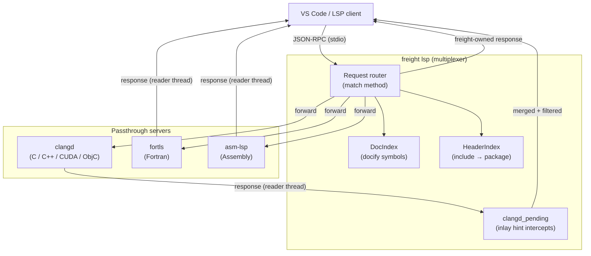
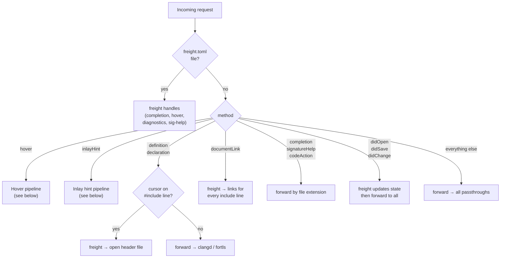
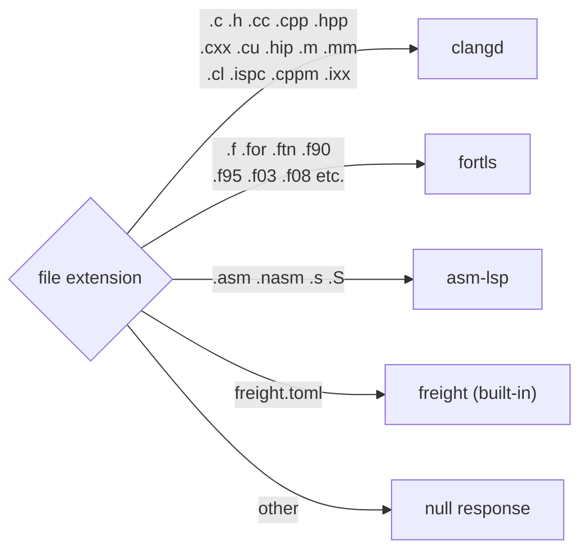
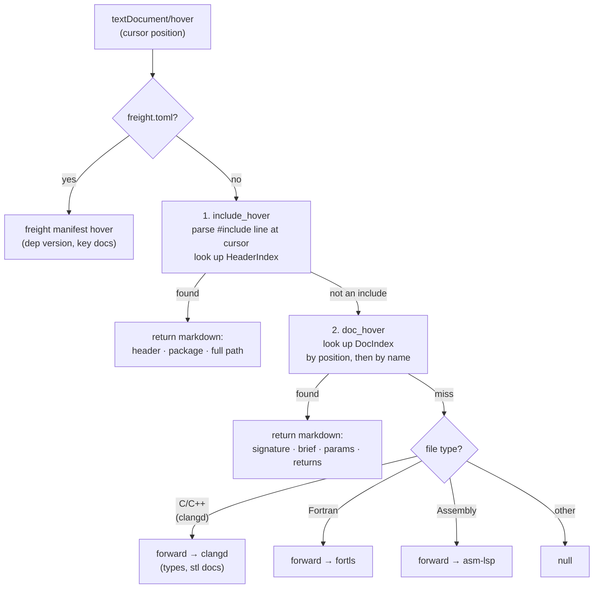
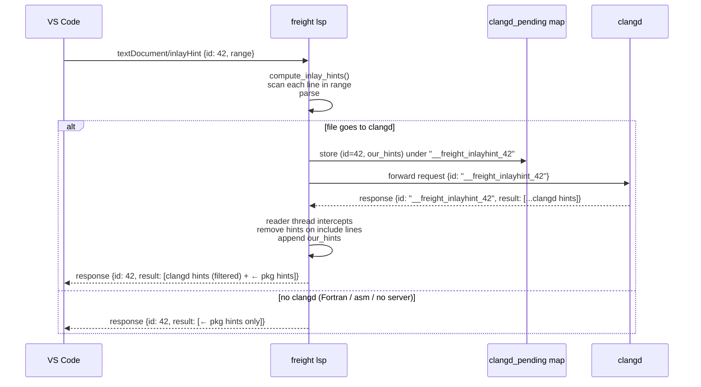
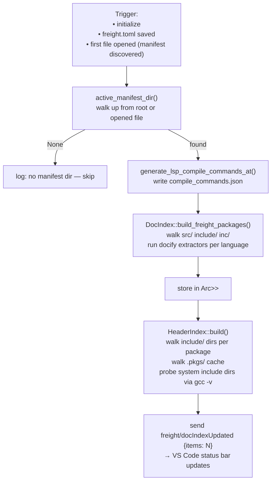
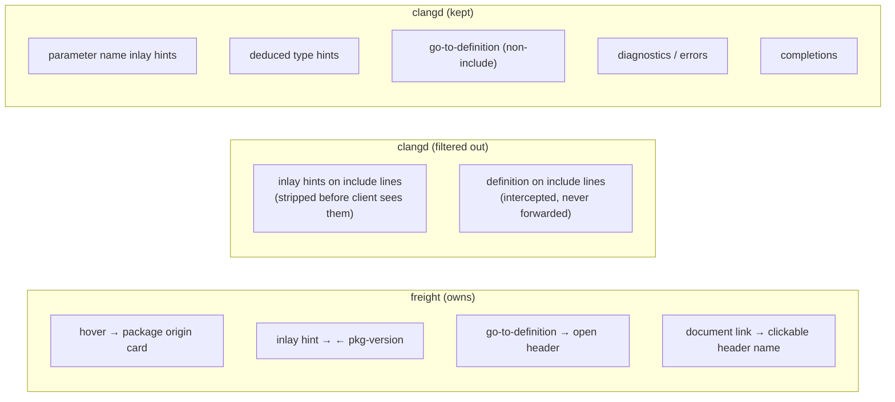

# Freight LSP Architecture

The freight language server is a **multiplexing proxy** that sits between VS Code and
the underlying language servers (clangd, fortls, asm-lsp). It intercepts requests it
can answer itself, enriches or filters what passes through, and owns all
include/import-related features entirely.

---

## Overall architecture

---

## Request routing

Which handler owns each LSP method:

---

## File extension → passthrough server

---

## Hover pipeline

---

## Inlay hint pipeline

---

## Doc index rebuild

---

## Include / import ownership

Summary of which layer owns each feature for `#include` / `import` lines:

